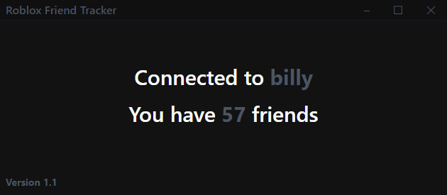

<p align="center">
  <a href="" rel="noopener">
 </a>
</p>

<h3 align="center">Severion</h3>

<div align="center">

[]()
[](/LICENSE)

</div>

---

<p align="center"> Severion is an app that lets you receive notifications when your friends change their status on Roblox.
    <br>
</p>

## 📝 Table of Contents

- [📝 Table of Contents](#-table-of-contents)
- [🧐 About ](#-about-)
- [⚙️ Features](#️-features)
- [🛠️ Upcoming Features](#️-upcoming-features)
- [🏁 Getting Started ](#-getting-started-)
  - [Installing](#installing)
- [🎈 Usage ](#-usage-)
- [Screenshot](#screenshot)
- [⛏️ Built Using ](#️-built-using-)
- [✍️ Authors ](#️-authors-)
- [🎉 Acknowledgements ](#-acknowledgements-)

## 🧐 About <a name = "about"></a>

Severion is an app that lets you receive notifications when your friends change their status on Roblox. Like Steam notifications.

## ⚙️ Features

- Possibility to run it in the background (Do not need to have the window constantly open)
- Receive notification when your friends join a game

## 🛠️ Upcoming Features

- Disable notification of a particular friends
- Join the friend's server when click on the notification
- Save cookies after each launch (safe way)

## 🏁 Getting Started <a name = "getting_started"></a>

This application still under development, but a first 1.0 release is on the way very soon.

For the moment, the only way to test the application is to download this github repo and perform the following instructions.

### Installing

A step by step series of examples that tell you how to get a development env running.

To start cloning the GitHub repertoire on your PC

```
git clone https://github.com/kanosy88/Severion.git
```

Then go to the file

```
cd ./Severion
```

Install all dependence

```
npm install
```

Launch write this to launch this order to launch the application to test the application in its development environment

```
npm run dev
```

If you want to have an executable version of the application (.exe) write this

```
npm run build:unpack
```

## 🎈 Usage <a name="usage"></a>

If everything is well installed you should receive notification each time one of your friends changes status after launching the application.

If this is not the case and you encounter an error. Please open a result.

## Screenshot




## ⛏️ Built Using <a name = "built_using"></a>

- [Electron](https://github.com/alex8088/electron-vite) - Template

## ✍️ Authors <a name = "authors"></a>

- [@kanosy](https://github.com/kanosy88) - Initial work

See also the list of [contributors](https://github.com/kanosy88/Severion/graphs/contributors) who participated in this project.

## 🎉 Acknowledgements <a name = "acknowledgement"></a>

- [@LxstCxn](https://github.com/LxstCxn/Roblox-notify-tracker) - Idea
